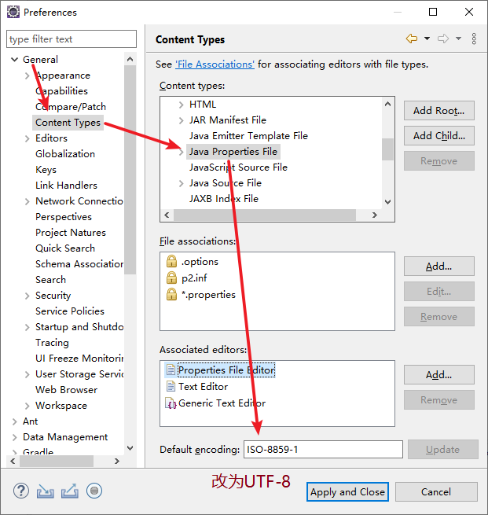

# Eclipse配置

## 设置Java Properties文件编码为UTF-8

General ⇒ Content Types ⇒ 在Content Types中找到Java Properties File点击设置Default encoding为UTF-8点击Update进行生效



## 设置边缘线为120

General ⇒ Editors ⇒ Text Editors 勾选 Show print margin 设置 column 为 120


## 显示空格符


General ⇒ Editors ⇒ Text Editors 勾选Show whitespace charactes 并点击旁边的 configure visibility

去掉显示回车与换行符


## 将其他文件Tab改为4个空格

Ant ⇒ Editor ⇒ Formatter 取消勾选 Use tab character instead of spaces


## 设置Java代码格式化

Java ⇒ Code Style ⇒ Formatter 新建一个profile


1. 设置Tab为4个空格


1. 枚举声明格式。点击旁边的按钮让枚举强制换行


1. 方法调用格式。旧版本Eclipse没有下方复选框，无需理会


## 设置Eclipse编译版本为JDK17


如果没有还安装JDK17，请将旧版本的JDK卸载后，安装JDK17并重新配置JAVA_HOME环境变量为JDK17安装目录

## 保存时

Java ⇒ Editor ⇒ Save Actions


## 设置包路径显示


Package Presentation ⇒ Hierarchical

## 显示当前文件路径


## 设置Eclipse运行时虚拟机内存大小

在Eclipse的安装目录下找到eclipse.ini配置文件进行编辑


```
-Xms1G
-Xmx8G
```

重启Eclipse生效